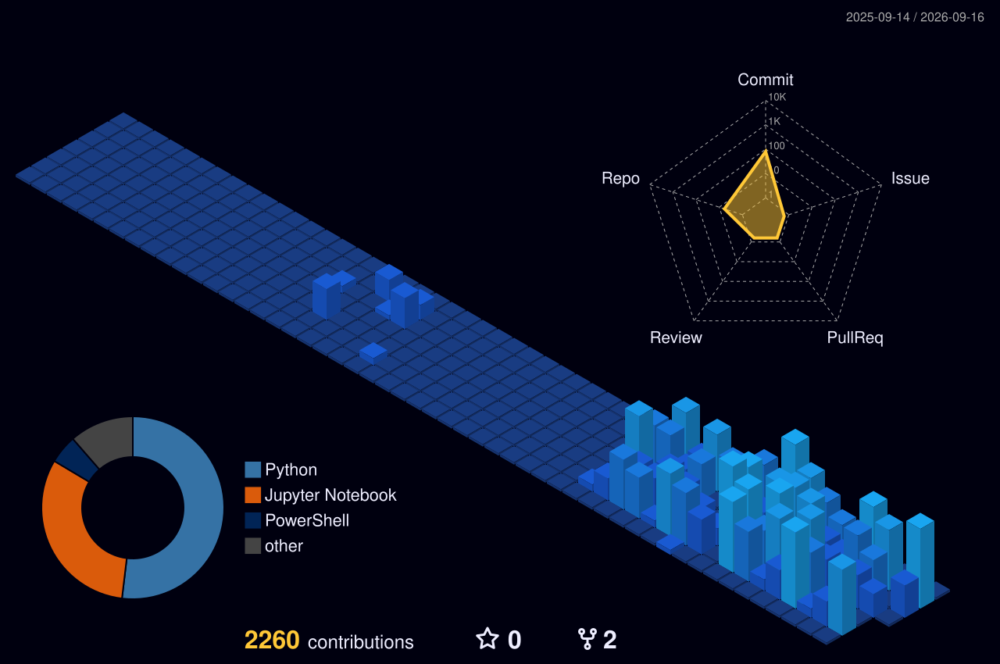

 
    <h2 style="border-bottom: 1px solid #d8dee4; color: #282d33;"> Hi, I'm Youngjun </h2>  
    
 
        <ul style="padding-left: 30px; list-style-type: disc; margin: 0;">
            <li>🎓 Graduated Yonsei University Department of Electronic and Electrical Engineering</li>
            <li>📚 Studying AI (Computer Vision, LLM, VLM...)</li>
        </ul>
    
 

    

    

    <h2 style="border-bottom: 1px solid #d8dee4; color: #282d33;"> 🛠️ Tech Stacks </h2>   
    
 
          
          
          
          
           
          
          
          

    

    

    <h2 style="border-bottom: 1px solid #d8dee4; color: #282d33;"> 🧑‍💻 Contact me </h2>   
    
 
          
    
    
  
 
    

    
    

